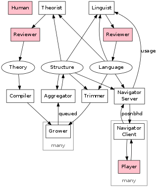

# Pomagma

A deductive database for partially ordered <a href="http://en.wikipedia.org/wiki/Magma_(algebra)">magmas</a>. 
An experimental <a href="http://en.wikipedia.org/wiki/Integrated_development_environment">IDE</a> for coding under <a href="https://en.wikipedia.org/wiki/Extension_(semantics)">extensional semantics</a>. 
A portal into the supremely beautiful mathematical universe. 
A toy model of <a href="http://en.wikipedia.org/wiki/Proofs_and_Refutations)">Lakatosian mathematical evolution</a>. 
A parallel distributed rewrite of <a href="http://github.com/fritzo/Johann">Johann</a> with a web front-end.

## System Architecture

### State

- Theory - inference rules and facts defining an algebra's relations
- Language - a probabilistic grammar defining an algebra's generators
- Structure - a finite substructure of the algebra; a knowledge base
- Corpus - a working set of interesting terms/positions in the algebra

### Actors

- Compiler - an optimizing compiler for forward-chaining inference
- Grower - a parallel Todd-Coxeter rules engine
- Aggregator - joins charts from growers into a global atlas
- Trimmer - cuts off pieces of the structure for further growth
- Editor - a user interface for exploring the mapped algebra
- Browser - a user interface for exploring the mapped algebra
- Theorist - statistically conjectures new relations
- Linguist - a Bayesian grammar optimizer / MCMC sampler

### Workflows

- Compile: build inference strategies and elementary facts from theory
- Grow: trim off piece of structure; grow it a little; aggregate it back in
- Edit: suggest code modifications around current editor state;
  record state in corpus
- Browse: traverse global history of recorded states
- Learn Language: optimize grammar weights and propose new concepts from corpus;
  review; commit language to git
- Revise Corpus: simplify corpus wrt grammar weights in language
  and equations known in structure
- Theorize: conjecture new equations from data in structure
- Recover (after an inconsistency event):
  empathize with Frege; regain composure; debug; start afresh

## Roadmap

- Language
    - Add languages to git: skjo
- Theory
    - Implement extensionality for quote/eval rules (skjo)
- Structure
    - Implement compressed S3 storage for atlas
- Compiler
    - Get types-as-closures rules to compile
    - Get quoting and reflection to compile
- Grower, Aggregator, Trimmer
    - Flesh out unit test to exercise all methods
        - Add tests for DenseSet::Iterator2, 3
    - Profile & optimize using system tests for sk, skj
- Controller
    - Implement master controller via python + SWF
    - Use boto to provision spot instances
- Editor
    - Adapt syntactic algorithms from [Johann](http://github.com/fritzo/Johann)
    - Implement HTML5 client
- Theorist
    - Adapt auto conjecturing algorithms from [Johann](http://github.com/fritzo/Johann)
    - Implement via Eigen+OpenMP
- Corpus, Browser
    - Decide on representation
    - Implement HTML5 client
- Linguist
    - Adapt language optimization algorithms from [Johann](http://github.com/fritzo/Johann)
    - Implement via Eigen+OpenMP
- Revisor
    - Adapt simplification algorithms from [Johann](http://github.com/fritzo/Johann)

## Milestones

- Prototyped - prove concept [DONE](http://github.com/fritzo/Johann)
- Parallel - run grower system tests (h4, sk, skj) DONE
- Scalable - implement aggregator, trimmer DONE
- Distributed - run grower workflow on ec2
- Interactive - implement editor as web-app
- Persistent - store edited documents in browsable corpus
- Adaptive - tune language to corpus
- Creative - make conjectures from structural knowledge
- Reflective - model grower within the theory

## License

Copyright (C) 2005-2013 Fritz Obermeyer 
Licensed under the MIT license: 
http://www.opensource.org/licenses/mit-license.php
