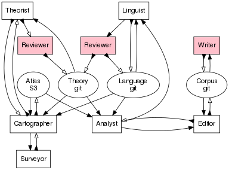

# Pomagma

An atlas of Abstractland.

## System Architecture

### State

- Law - XXX
- Vehicle - known means of navigating Abstractland
- Physical Atlas - a knowledge base of a prior facts about Abstractland
- Cultural Atlas - a knowledge base of humankind's presence in Abstractland

### Actors

- Strategist - finds optimal legal surveying strategies
- Surveyor - explores and measures uncharted territory
- Cartographer - directs surveyors and incorporates surveys into the atlas
- Vehicle - carries passengers on tours through Abstractland
- Mechanical Engineer - optimizes vehicles for specific terrain
- Materials Engineer - develops new modes of transportation
- Civil Engineer - carefully constructs roads between common destinations

### Workflows

- Compile: build inference strategies and elementary facts from theory
- Grow: trim off piece of structure; grow it a little; aggregate it back in
- Edit: suggest code modifications around current editor state;
  record state in corpus
- Browse: traverse global history of recorded states
- Learn Language: optimize grammar weights and propose new concepts from corpus;
  review; commit language to git
- Revise Corpus: simplify corpus wrt grammar weights in language
  and equations known in structure
- Theorize: conjecture new equations from data in structure
- Recover (after an inconsistency event):
  empathize with Frege; regain composure; debug; start afresh

## Progress

- Prototyped - prove concept [DONE](http://github.com/fritzo/Johann)
- Parallel - run surveyor system tests (h4, sk, skj) DONE
- Scalable - implement cartographer DONE
- Distributed - run survey workflow on ec2
- Interactive - implement vehicle as web-app
- Persistent - record routes in cultural atlas
- Adaptive - tune vehicle based on routes
- Productive - build new roads based on travel patterns
- Reflective - locate agents within Abstractland

## License

Copyright (C) 2005-2013 Fritz Obermeyer 
Licensed under the MIT license: 
http://www.opensource.org/licenses/mit-license.php
