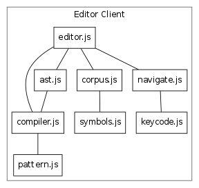

# For Developers

## Dataflow Architecture

### State

- Languages - finite generating grammars of combinatory algebras
- Theory - finite relational theories of combinatory algebras
- Atlas - an algebraic knowledge bases of relations in each algebra
- Corpus - collected writings compilable to combinatory algebra expressions

### Actors

- Compiler - creates core theory and surveying strategies
- Surveyors - explore a region of a combinatory algebra via forward chaining
- Cartographers - direct surveyors and incorporate surveys into the atlas
- Linguist - fits languages to the corpus and proposes new basic terms
- Language Reviewer - ensures new language modifications are safe
- Theorist - makes conjectures and tries to prove them using various strategies
- Theory Reviewer - suggests new inference stragies to address open conjectures
- Editor - provides user interface for editing algebraic code
- Analyst - performs deeper static analysis to support editor

### Workflows

- Compile: interpret theory to create core facts and inference strategies
- Explore: expand atlas by surveying and inferring global facts
- Edit: write code; respond to static analysis of code
- Evolve Language: optimize grammar weights based on corpus; propose new words
- Recover (after Fregean collapse): assess damage; pinpoint problem; rebuild

## Milestones 

- [x] Viable - prove concept in prototype
- [x] Parallel - run surveyor system tests (h4, sk, skj)
- [x] Scalable - run surveyor-cartographer loop
- [x] Thrifty - propose new equations based on atlas
- [x] Interactive - show static analysis layer in editor
- [ ] Tasteful - fit language parameters to corpus
- [ ] Literate - populate corpus by writing code in editor
- [ ] Innovative - propose new basic terms based on corpus
- [ ] Reflective - model pomagma actors in corpus
- [ ] Social - integrate with other languages and environments

